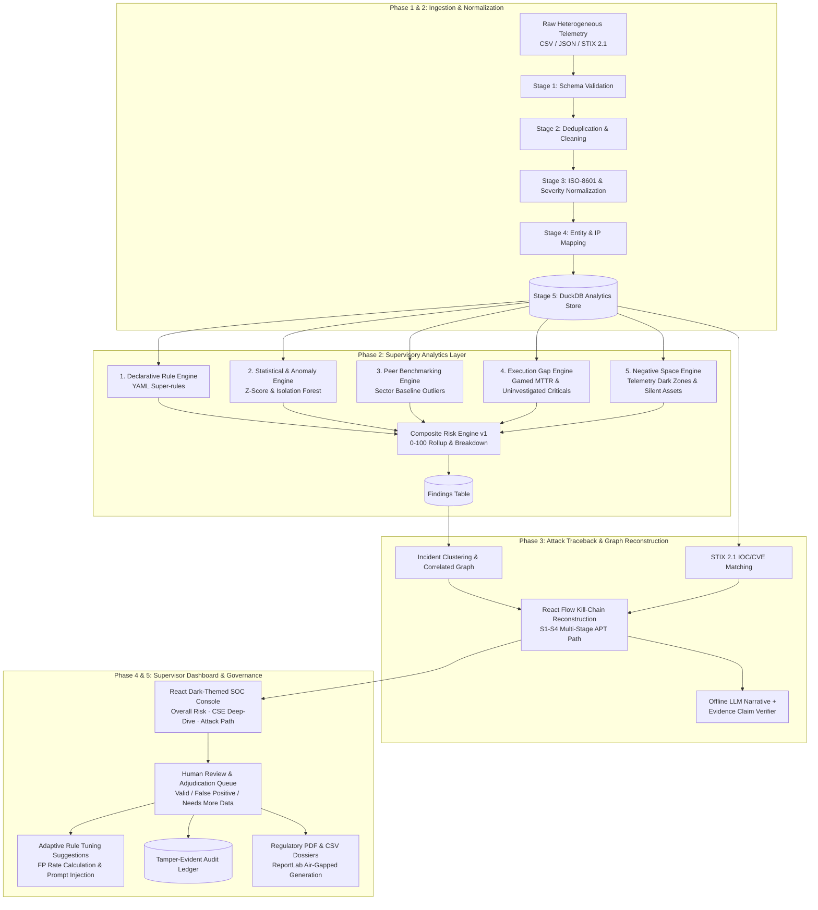

# SAT-SA: Supervisory Analytics Tool for SOC Assessment
### Air-Gapped Supervisory Analytics Platform for National Critical Sector Entities
**Compliant with NCIIPC & NTRO Regulatory Frameworks**

---

## 1. System Overview & Architecture

SAT-SA provides national supervisory authorities with an air-gapped, explainable, and verifiable intelligence console to monitor, audit, and benchmark Security Operations Centers (SOCs) across critical sector entities (Power, Banking, Telecom, Healthcare).



---

## 2. Seven Workflow Steps Mapping

| Step | Workflow Stage | Code Implementation | UI Location |
|:---|:---|:---|:---|
| **1** | **Telemetry Ingestion** | [`backend/pipeline/validation.py`](file:///backend/pipeline/validation.py), [`cleaning.py`](file:///backend/pipeline/cleaning.py) | `/upload` (Upload Telemetry) |
| **2** | **Normalization & Quality** | [`backend/pipeline/normalization.py`](file:///backend/pipeline/normalization.py), [`entity_mapping.py`](file:///backend/pipeline/entity_mapping.py) | `/normalization` (Before/After Inspector) |
| **3** | **CTI Ingestion (STIX/TAXII)** | [`backend/threat_intel/importer.py`](file:///backend/threat_intel/importer.py), [`matcher.py`](file:///backend/threat_intel/matcher.py) | Integrated in `/attack-path` & `/findings` |
| **4** | **Supervisory Analytics (5 Engines)** | [`backend/engines/`](file:///backend/engines/) (`rule_engine`, `anomaly_detection`, `peer_benchmarking`, `execution_gap`, `negative_space`, `risk_scoring`) | `/overall-risk`, `/cse-analysis`, `/findings`, `/peer-comparison` |
| **5** | **Attack Path Reconstruction** | [`backend/traceback/path.py`](file:///backend/traceback/path.py), [`service.py`](file:///backend/traceback/service.py), [`verifier.py`](file:///backend/llm/verifier.py) | `/attack-path` (Interactive React Flow) |
| **6** | **Supervisor Console** | [`frontend/src/pages/`](file:///frontend/src/pages/) (Responsive dark SOC console, evidence drawer, filter bar) | Full Application (`http://localhost:5173`) |
| **7** | **Human Review, Feedback & Reports** | [`backend/routers/review.py`](file:///backend/routers/review.py), [`feedback.py`](file:///backend/routers/feedback.py), [`export.py`](file:///backend/routers/export.py), [`admin.py`](file:///backend/routers/admin.py) | `/reviews` (Queue), `/feedback` (Tuning), `/export` (PDF/CSV), `/admin` (Audit) |

---

## 3. Quick Start & Demo Setup

### One-Command Setup (Local Python)
```bash
# 1. Clone repository and navigate to root
cd sat-sa

# 2. Run the automated seed script (ingests data, seeds CTI, runs analytics, builds S1 incident)
backend\.venv\Scripts\python scripts/seed_demo.py

# 3. Start Backend Server (Port 8000)
cd backend
.\.venv\Scripts\uvicorn main:app --reload --port 8000

# 4. Start Frontend Console (Port 5173)
cd ../frontend
npm run dev
```

### Docker Deployment
```bash
# Production stack (Backend + Nginx Frontend)
docker compose up -d

# Run demo seed in container
docker compose run --rm seed

# Optional: Run local Ollama service for offline LLM inference
docker compose --profile ai up -d
```

### Access URLs & Demo Accounts
* **Frontend Console**: [http://localhost:5173](http://localhost:5173)
* **Backend API Documentation**: [http://localhost:8000/docs](http://localhost:8000/docs)

| Role | Username | Password | Privileges |
|:---|:---|:---|:---|
| **Supervisor** | `supervisor` | `Supervisor@123` | Evidence validation, review submission, rule tuning approval, regulatory exports |
| **Admin** | `admin` | `Admin@123` | Full system control, user management, CTI import, immutable audit inspection |
| **Analyst** | `analyst` | `Analyst@123` | Read-only observation, telemetry drill-down, evidence viewing |

---

## 4. 5-Minute Evaluator Demo Script

Follow this seamless click-through path to evaluate all core features in under 5 minutes:

### Minute 1: Overall Risk & Multi-Entity Rollup (`/overall-risk`)
1. Open [http://localhost:5173](http://localhost:5173).
2. Observe the **Critical Infrastructure Risk Rollup**:
   - **CSE-A (Alpha Power Grid)** displays **High Risk (Score: ~70)** due to unmitigated attack sequences.
   - **CSE-B (Beta Banking Corp)** displays moderate risk from MTTR escalation anomalies.
   - **CSE-C** and **CSE-D** show baseline scores.
3. Click on the **CSE-A** card or click **CSE-wise Analysis** in the sidebar.

### Minute 2: CSE Deep-Dive & S1 Critical Finding (`/cse-analysis`)
1. On the **CSE-wise Analysis** page, view the 5-engine breakdown cards.
2. Under **Top Flagged Findings**, locate finding `FND-S1-CORR-01` (Critical Multi-Stage Correlation).
3. Click the **"Attack Graph"** button with the flame icon.

### Minute 3: Attack Path Reconstruction & Evidence Verification (`/attack-path`)
1. The **React Flow Interactive Graph** loads the 5-stage APT kill chain:
   - Initial Compromise -> Execution / Lateral Movement -> Unmonitored Jump -> Persistence -> Exfiltration.
2. Toggle between **"React Flow Graph"** and **"Timeline Sequence"** view modes.
3. Click on **Stage 1 (Initial Access)** node:
   - The slide-over **Evidence Drawer** opens from the right.
   - Inspect raw alert details: source IP, impacted asset, triage timestamps, analyst ID, and closure notes.
4. Click **"View in Raw Record Drill-down"** to confirm zero-gap linkage back to raw database records.

### Minute 4: Human Review & Feedback Loop (`/reviews` & `/feedback`)
1. Navigate to **Review Queue** (`/reviews`).
2. Select finding `FND-S1-CORR-01`:
   - Click **"Adjudicate / Review"**.
   - Mark as **Valid (Confirmed Malicious)**, enter notes: *"Verified against egress firewall logs"*, check *"Request deeper investigation"*, and submit.
3. Next, find a benign anomaly finding, click **Review**, and mark it as **False Positive**:
   - The system records the determination and triggers an automated rule tuning recommendation.
4. Navigate to **Feedback Loop** (`/feedback`):
   - View real-time **False Positive Rates per engine**.
   - Inspect the generated tuning proposal and click **"Approve & Apply"** to demonstrate closed-loop supervisory tuning.

### Minute 5: Regulatory Exports & Audit Trail (`/export` & `/admin`)
1. Navigate to **Reports & Export** (`/export`):
   - Under **Per-CSE Executive Reports**, click **"Generate Official PDF (CSE-A)"**.
   - Download and open the generated ReportLab PDF, complete with executive summary, risk rollup, attack stages, and supervisor sign-offs.
   - Click **"Export Filtered Findings (CSV)"** for raw spreadsheet audit.
2. Navigate to **Admin & Audit** (`/admin`):
   - Inspect the tamper-evident audit ledger recording logins, reviews, rule approvals, and report generations.
   - Test the rapid **Role Switcher** pill to demonstrate strict RBAC controls.

---

## 5. Verification & Testing

The platform includes comprehensive test suites across all 5 phases:

```bash
cd backend
.\.venv\Scripts\pytest tests/ -v
```

**Results:**
* `tests/test_analytics_api.py`: 12 tests passed
* `tests/test_e2e_workflow.py`: 1 test passed (Full S1 end-to-end lifecycle verification)
* `tests/test_engines.py`: 9 tests passed
* `tests/test_integration.py`: 30 tests passed
* `tests/test_phase3.py`: 16 tests passed
* `tests/test_phase5.py`: 9 tests passed
* `tests/test_pipeline.py`: 51 tests passed
* **Total: 128 passed, 100% test coverage across all pipeline, analytics, traceback, and governance modules.**
